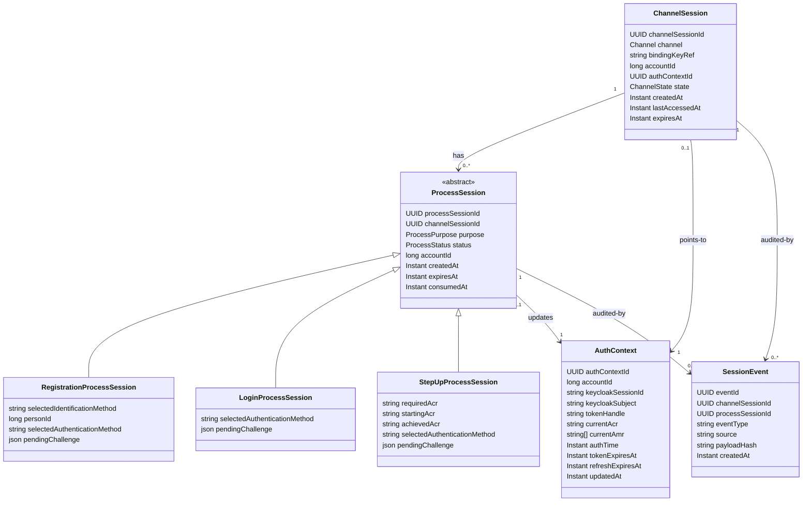
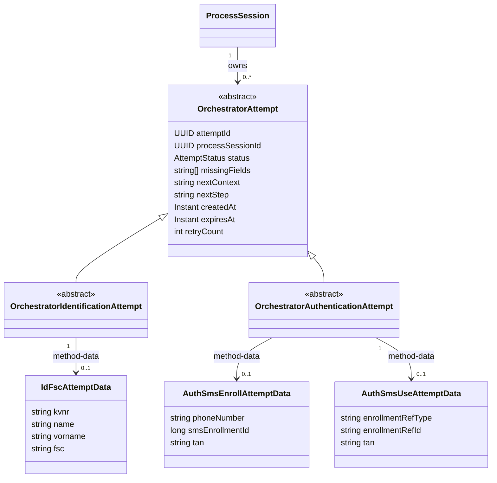
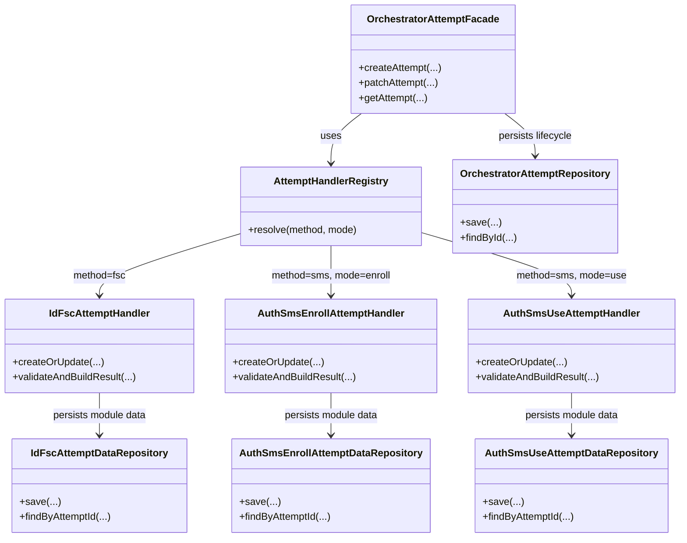
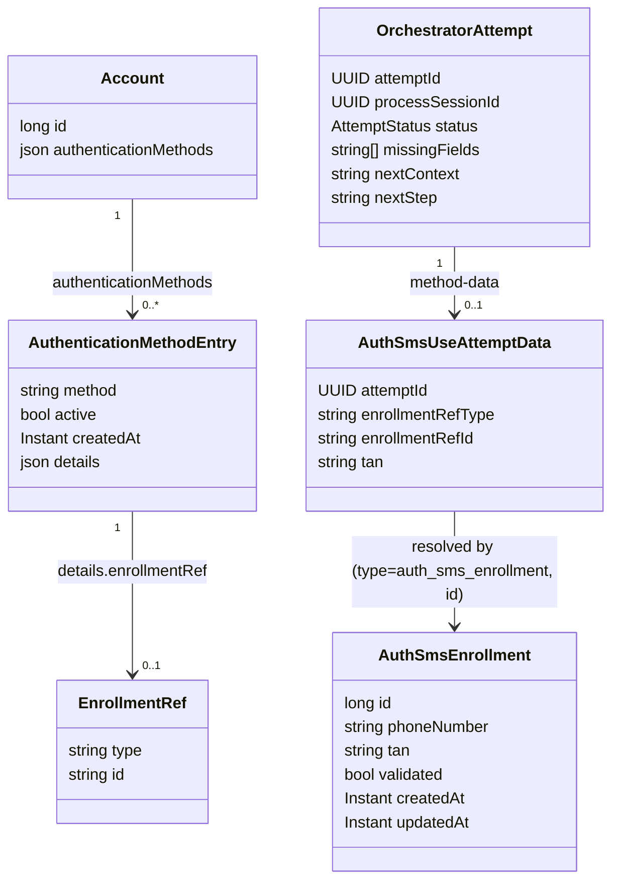
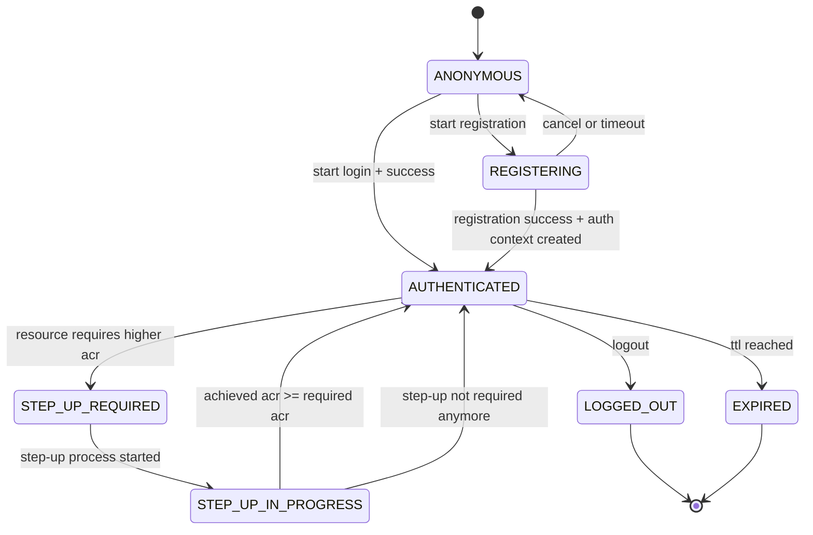
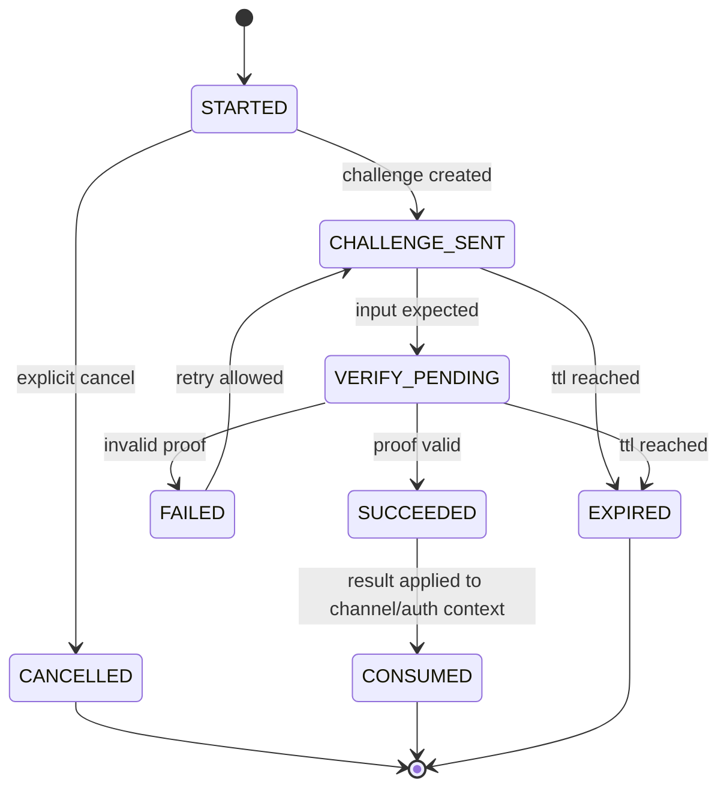

# Orchestrator-Keycloak Session-Kopplung

## Ziel und Scope

Dieses Dokument beschreibt ein umsetzbares Zielmodell fuer die Kopplung von fachlicher Orchestrator-Session und Keycloak-IAM-Session fuer:

- **App-Kanal**: Login startet fachlich im Orchestrator, danach wird Keycloak-Auth-Kontext erzeugt.
- **Web-Kanal**: Keycloak-Session existiert bereits, Orchestrator steuert nur Verfahren (z. B. Step-up).

Nicht Teil dieses Dokuments:

- konkrete Keycloak-SPI-Implementierung
- Infrastruktur-Details (Redis/DB-Cluster/Secrets-Management)

---

## Begriffe

- **ChannelSession**: langlebiger serverseitiger Kanal-Kontext (App/Web), nie direkt fachlicher Challenge-State.
- **ProcessSession**: kurzlebiger fachlicher Verfahrens-Kontext (Registration, Login, Step-up).
- **AuthContext**: serverseitig gespeicherter IAM-Kontext inkl. Keycloak-Token-Referenz und `acr`/`amr`.
- **binding_key_ref**: Binding-Referenz aus DPoP-Keymaterial fuer App-Bindung.

---

## 1) Statisches Modell (Entitaeten)

### 1.1 Klassenmodell



### 1.1.1 Prozessklassen statt flachem Objekt

- `ProcessSession` ist die abstrakte Basis mit gemeinsamem Lifecycle und Referenzen.
- `RegistrationProcessSession` kapselt nur Registrierungsdaten (z. B. `personId`, Identifikation, Enrollment-Flow).
- `LoginProcessSession` kapselt nur Login-Daten (methodenspezifische Challenge ohne Identifikationsdaten).
- `StepUpProcessSession` kapselt ACR-spezifische Step-up-Daten (`requiredAcr`, `startingAcr`, `achievedAcr`).
- Persistenz darf physisch weiterhin eine Tabelle nutzen, aber das Domain-Modell arbeitet mit konkreten Typen statt einem grossen, flachen JSON-Objekt.

### 1.1.2 Entitaetsmodell fuer Identification-/Authentication-Attempts



- `OrchestratorAttempt` (plus Untertypen) bleibt im Orchestrator-Modul und enthaelt nur lifecycle-/routing-relevante Felder.
- Methodenbezogene Attempt-Daten liegen in den jeweiligen Modulen: `IdFscAttemptData` im Modul `id_fsc`, `AuthSmsEnrollAttemptData`/`AuthSmsUseAttemptData` im Modul `auth_sms`.
- Das gilt gleichermassen fuer Identification- und Authentication-Attempts.
- Die Attempt-Entitaeten bilden direkt das API-Muster `POST` (anlegen), `PATCH` (anreichern/verifizieren), `GET` (lesen) ab.
- Fuer `sms/use` wird kein fester `smsEnrollmentId` als Core-Feld angenommen; stattdessen verwendet das Modell eine generische Enrollment-Referenz (`enrollmentRefType`, `enrollmentRefId`), die fachlich auf einen Enrollment-Datensatz im jeweiligen Modul zeigt (bei SMS auf `auth_sms`).
- Strikte Regel fuer dieses Zielbild: Der Orchestrator persistiert keine methodenspezifischen Fachdaten (auch nicht `method`/`mode`/fachliche Ergebnisdetails); diese liegen ausschliesslich in den Methodenmodulen.

### 1.1.3 Modulklassen fuer Attempt-Verarbeitung



- Orchestrator-Modul: `OrchestratorAttemptFacade`, `AttemptHandlerRegistry`, `OrchestratorAttemptRepository`.
- Modul `id_fsc`: `IdFscAttemptHandler` plus `IdFscAttemptDataRepository`.
- Modul `auth_sms`: `AuthSmsEnrollAttemptHandler`/`AuthSmsUseAttemptHandler` plus zugehoerige Repositories.
- Damit sind im Bild sowohl der zentrale Lifecycle als auch die eigentlichen Fachklassen in den Modulen sichtbar.

### 1.1.4 Konkretes Datenmodell fuer `sms/use`

Zielprinzip:

- SMS-Fachlogik (TAN erzeugen/senden/pruefen) liegt ausschliesslich im Modul `auth_sms`.
- Der Orchestrator speichert nur Attempt-Lifecycle, Routing und Referenzen.
- Der Account speichert aktive Methoden plus generische Enrollment-Referenz in `details`.

Konkrete Persistenzsicht:



Beispiel fuer einen Eintrag in `account.authenticationMethods`:

```json
{
  "method": "sms",
  "active": true,
  "createdAt": "2026-08-17T10:15:30Z",
  "details": {
    "enrollmentRef": {
      "type": "auth_sms_enrollment",
      "id": "4711"
    }
  }
}
```

Speicherorte:

- Tabelle `account`: enthaelt `authenticationMethods` (JSON-Array) mit generischer Referenz auf Enrollment-Daten.
- Tabelle `auth_sms`: enthaelt SMS-Enrollment inkl. `phoneNumber`, `tan`, `validated`.
- Orchestrator-Attempt-Tabelle (Zielbild, z. B. `orchestrator_attempt`): enthaelt nur technische Attempt-Metadaten (`status`, `missingFields`, `nextContext`, `nextStep`, `processSessionId`, Zeitstempel).
- Modul-Tabelle fuer `AuthSmsUseAttemptData` (Zielbild im Modul `auth_sms`): enthaelt `attemptId`, `enrollmentRefType`, `enrollmentRefId`, `tan`.

### 1.1.5 Detaillierter Code-Flow fuer `sms/use`

#### Verantwortungen je Modul

- Orchestrator (`orchestrator`): API-Routing, Attempt-Lifecycle (`INPUT_REQUIRED`/`VERIFIED`), `next`-Ermittlung, Prozess-Gating.
- SMS-Modul (`auth_sms`): TAN erzeugen, TAN senden (Mock/Provider), TAN validieren, Laden der referenzierten Enrollment-Daten.
- Account-Modul (`account`): aktive Authentifizierungsmethoden und generische Enrollment-Referenz (`details.enrollmentRef`) bereitstellen.

#### Ablauf `sms/use` (Zielbild)

1. `POST /orchestrator/api/v1/app/channels/{channelSessionId}/authentication-methods/sms/use/attempts`
   - Orchestrator legt eine technische Attempt-Ressource an.
   - Orchestrator persistiert in `orchestrator_attempt`:
     - `attemptId`, `processSessionId`, `status=INPUT_REQUIRED`, `missingFields=["tan"]`, `nextContext=sms`, `nextStep=tanInput`.
   - Orchestrator delegiert an `AuthSmsUseAttemptHandler` (im Modul `auth_sms`).
   - `AuthSmsUseAttemptHandler` liest aus `account.authenticationMethods[].details.enrollmentRef` die aktive Enrollment-Referenz.
   - `auth_sms` loest Referenz auf `auth_sms.id` auf, erzeugt TAN, schreibt TAN nach `auth_sms.tan` (und ggf. `updatedAt`), versendet SMS.
   - `auth_sms` speichert in `auth_sms_use_attempt_data` die technischen Bezugsdaten (`attemptId`, `enrollmentRefType`, `enrollmentRefId`), optional noch ohne `tan`.
   - Response: `201`, `status=INPUT_REQUIRED`, `missingFields=["tan"]`, `next={context:"sms",step:"tanInput"}`.

2. `PATCH /orchestrator/api/v1/authentication-methods/sms/use/attempts/{attemptId}` mit `{ "tan": "..." }`
   - Orchestrator validiert nur Request-Form und Attempt-Status, dann Delegation an `AuthSmsUseAttemptHandler`.
   - `auth_sms` liest `auth_sms_use_attempt_data` per `attemptId`, loest Enrollment-Referenz auf und verifiziert TAN gegen `auth_sms.tan`.
   - Bei Erfolg schreibt `auth_sms` in `auth_sms.validated=true` (und `updatedAt`).
   - Optional: eingereichte TAN in `auth_sms_use_attempt_data.tan` fuer Audit/Retry-Regeln.
   - Orchestrator schreibt Ergebnis in `orchestrator_attempt`:
     - `status=VERIFIED`, `missingFields=[]`, `nextContext=authentication`, `nextStep=authenticated`.
   - Response: `200`, `status=VERIFIED`, `next={context:"authentication",step:"authenticated",...}`.

3. `GET /orchestrator/api/v1/authentication-methods/sms/use/attempts/{attemptId}`
   - Orchestrator liest `orchestrator_attempt` und liefert technischen Zustand (`status`, `missingFields`, `result`, `next`).
   - Keine SMS-Fachlogik im GET.

#### Fehlerfaelle

- Falsche TAN: fachlicher Fehler aus `auth_sms`, HTTP `422`.
- Attempt in ungueltigem Zustand (z. B. bereits `VERIFIED`): Orchestrator liefert HTTP `409`.
- Unbekannte Referenz (`enrollmentRef`) oder fehlendes Enrollment: HTTP `422` oder `404` gemaess Fehlervertrag.

### 1.2 Enumerationen

- `Channel`: `APP`, `WEB`
- `ChannelState`: `ANONYMOUS`, `REGISTERING`, `AUTHENTICATED`, `STEP_UP_REQUIRED`, `STEP_UP_IN_PROGRESS`, `LOGGED_OUT`, `EXPIRED`
- `ProcessPurpose`: `REGISTRATION`, `LOGIN`, `STEP_UP`
- `ProcessStatus`: `STARTED`, `CHALLENGE_SENT`, `VERIFY_PENDING`, `SUCCEEDED`, `FAILED`, `CANCELLED`, `EXPIRED`, `CONSUMED`
- `AttemptStatus`: `INPUT_REQUIRED`, `VERIFIED`, `FAILED`, `EXPIRED`, `CANCELLED`

### 1.3 Persistenz-Regeln

- `ChannelSession.channelSessionId` ist stabil und opaque; App/Web kennen nur diese technische Referenz.
- `ProcessSession` ist immer kurzlebig und nach Abschluss `CONSUMED` oder `EXPIRED`.
- Prozessspezifische Felder werden nur im jeweils passenden Typ gefuehrt (keine "immer vorhandenen" Universal-Felder).
- Attempt-Lifecycle und Routing-Metadaten liegen zentral im Orchestrator; methodenspezifische Attempt-Felder liegen in den jeweiligen Fachmodulen.
- Attempt-Lifecycle und Routing-Metadaten liegen zentral im Orchestrator; methodenspezifische Attempt-Felder und fachliche Verifikationsdetails liegen ausschliesslich in den jeweiligen Fachmodulen.
- `AuthContext` ist serverseitig; Clients sehen keine Keycloak-Tokens.
- `ChannelSession.state` ist die primäre Runtime-Entscheidungsquelle fuer Request-Gating.
- App-Bindung: `ChannelSession.bindingKeyRef` muss mit aktuellem DPoP-Ableitungswert matchen.

---

## 2) Zustandsdiagramme

### 2.1 ChannelSession-Zustaende



### 2.2 ProcessSession-Zustaende



---

## 3) Kanal-Ablaufmodell

### 3.1 App (Orchestrator-first)

1. App sendet Request mit DPoP -> Backend erstellt/liest `ChannelSession(APP)`.
2. Fuer Erstzugang startet Backend `ProcessSession(REGISTRATION|LOGIN)`.
3. Orchestrator fuehrt fachliche Verfahren aus (FSC/SMS/eID).
4. Bei Erfolg erzeugt Backend den `AuthContext` (Keycloak-Tokenfluss serverseitig).
5. `ChannelSession.state` wechselt auf `AUTHENTICATED`.
6. Bei spaeteren Requests prueft Backend `currentAcr/currentAmr` aus `AuthContext`.
7. Falls Niveau nicht reicht: `STEP_UP_REQUIRED` -> neue `ProcessSession(STEP_UP)`.

### 3.2 Web (Keycloak-first)

1. Browser/BFF hat Keycloak-Session.
2. Keycloak-Authenticator startet bei Bedarf Step-up beim Orchestrator.
3. Backend erstellt `ProcessSession(STEP_UP)` und referenziert die `ChannelSession(WEB)`.
4. Nach fachlichem Erfolg aktualisiert Keycloak den IAM-Kontext.
5. Backend synchronisiert `AuthContext.currentAcr/currentAmr`.
6. `ChannelSession.state` bleibt oder wird wieder `AUTHENTICATED`.

---

## 4) API-Spezifikation

### 4.1 API-Spezifikation (implementiert)

Festgelegte API-Entscheidung:

- Das oeffentliche API wird unter `/orchestrator/api/v1` versioniert.
- Unterschiedliche Methoden und Modi werden ueber getrennte konkrete Endpunkte modelliert.
- Die URL bestimmt die Operation; derselbe Endpunkt darf nicht allein anhand unterschiedlicher Request-Bodies verschiedene fachliche Ablaufe ausfuehren.
- Vorbereitende Methoden nutzen ressourcenorientierte Attempt-Objekte: `POST` legt an, `PATCH` aktualisiert die bestehende Attempt-Ressource partiell, `GET` liest den Stand.
- Bei `PATCH` wird grundsaetzlich nur der aktuell nachzuliefernde oder zu aendernde Teil uebergeben; bereits vorhandene Felder duerfen dabei gezielt ueberschrieben werden.
- Solange Pflichtdaten fehlen, bleibt die Ressource in `INPUT_REQUIRED` (HTTP `200`, kein Fehlerfall); bei Vollstaendigkeit liefert sie `VERIFIED` plus `result`.
- HATEOAS wird im Zielbild nicht verwendet.
- Der Client leitet den naechsten technischen Call aus `next.context`, `next.step` und - falls vorhanden - dem gewaehlten Eintrag aus `methods` ueber eine feste Routing-Tabelle ab.
- Lesbarkeit hat Vorrang vor maximal generischem API-Wiring: methoden- und modusspezifische Endpunkte sowie klar benannte DTOs/Handler (`fsc`, `sms/enroll`, `sms/use`) sind gewollt, auch wenn dafuer etwas mehr expliziter Code entsteht.

#### App-Fassade (Orchestrator-first)

Die folgenden Endpunkte sind als Zielbild fuer einen durchgaengigen App-Flow gedacht. Alle Requests enthalten den Header `DPoP: <proof>`.

Designentscheidung:

- `processSessionId` bleibt als interne Prozessinstanz fuer Persistenz, Korrelation und Audit erhalten.
- Die fachliche Prozesswahl (`REGISTRATION`, `LOGIN`, `STEP_UP`) trifft das Backend auf Basis von Kanalzustand, Accountstatus und Policy.
- Oeffentliche App-APIs verwenden nur `channelSessionId`; weder `purpose` noch die interne `processSessionId` werden vom Client vorgegeben.
- Das `next`-Objekt nutzt genau zwei fachliche Routing-Attribute: `context` und `step`.
- Bei Auswahlseiten enthaelt `next.methods` nur echte technische Methoden-Keys wie `sms` oder `passkey`; der Modus steckt dort nicht, sondern im `context`.
- Die UI leitet den naechsten Call aus `(context, step)` und - bei Auswahlseiten - aus dem gewaehlten `methods`-Eintrag ab; URLs sind feste technische Endpunkte und keine Entscheidungsquelle.
- Der Client darf `enroll` vs. `use` nie aus Sessionzustand oder aus einer Methodenliste erraten; der Modus wird serverseitig ueber `context = enrollment|use` festgelegt.
- Wenn genau eine Methode erlaubt ist, darf das Backend die Auswahlseite ueberspringen und direkt den methodenspezifischen Folgeschritt liefern, z. B. `{ "context": "sms", "step": "enroll" }` oder `{ "context": "sms", "step": "use" }`.
- Ergebnislieferung: Sobald eine Attempt-Ressource vollstaendig und validiert ist, liefert dieselbe Ressource das fachliche `result` im Response-Body.

Pfadkonvention:

- Einstieg: `POST /orchestrator/api/v1/app/channels`
- Laufende Prozessschritte: `/orchestrator/api/v1/app/channels/{channelSessionId}/...`
- Attempt-Endpunkte: `/orchestrator/api/v1/identification-methods/...` und `/orchestrator/api/v1/authentication-methods/...`

Konsistenzregel:

- Pro `channelSessionId` darf es hoechstens einen aktiven oeffentlichen Prozesskontext geben. Welcher interne `purpose` dazu gehoert, entscheidet und verwaltet das Backend.

Konsistentes Beispiel ueber alle Calls:

- `channelSessionId`: `c1111111-1111-1111-1111-111111111111`
- Identifikation: `fsc`
- Authentifizierung: `sms`

##### 1) `POST /orchestrator/api/v1/app/channels`

Zweck:

- Erstkontakt der App mit dem Backend.
- Liefert eine neue oder bestehende `ChannelSession`.
- Das Backend leitet dabei sofort den aktuell noetigen fachlichen Prozess ab und liefert direkt den ersten fachlichen `next`-Schritt.

Request (optional, wenn App eine bestehende Channel-Session fortsetzen will):

```json
{
  "channelSessionId": null
}
```

Response `200`:

```json
{
  "channelSessionId": "c1111111-1111-1111-1111-111111111111",
  "state": "ANONYMOUS",
  "next": {
    "context": "registration",
    "step": "selectIdentificationMethod",
    "identificationMethods": ["fsc"]
  }
}
```

##### 2) `POST /orchestrator/api/v1/app/channels/{channelSessionId}/identification-methods/fsc/attempts`

Zweck:

- Legt eine FSC-Attempt-Ressource an.
- In diesem Beispiel: `fsc`.
- Kann bereits alle FSC-Pflichtdaten enthalten oder nur einen Teil davon.

Request:

```json
{
  "kvnr": "A123456789",
  "name": "Muster",
  "vorname": "Max"
}
```

Response `201` bei unvollstaendiger Eingabe:

```json
{
  "attemptId": "i7777777-7777-7777-7777-777777777777",
  "status": "INPUT_REQUIRED",
  "missingFields": ["fsc"],
  "result": null,
  "next": {
    "context": "fsc",
    "step": "input"
  }
}
```

Wenn der `POST` bereits `kvnr`, `name`, `vorname` und `fsc` enthaelt, kann direkt `VERIFIED` plus `result` geliefert werden.

##### 3) `PATCH /orchestrator/api/v1/identification-methods/fsc/attempts/{attemptId}`

Zweck:

- Ergaenzt fehlende Felder auf derselben FSC-Attempt-Ressource; bei Bedarf duerfen bereits gesetzte Felder gezielt ueberschrieben werden.

Request:

```json
{
  "fsc": "TESTCODE123"
}
```

Response `200` bei erfolgreicher Verifikation:

```json
{
  "attemptId": "i7777777-7777-7777-7777-777777777777",
  "status": "VERIFIED",
  "missingFields": [],
  "result": {
    "identified": true,
    "personId": 5001
  },
  "next": {
    "context": "enrollment",
    "step": "selectMethod",
    "methods": ["sms"]
  }
}
```

##### 4) `GET /orchestrator/api/v1/identification-methods/fsc/attempts/{attemptId}`

Zweck:

- Liest den aktuellen Zustand der FSC-Attempt-Ressource.
- Dient fuer Resume/Polling und UI-Synchronisation.

Request:

Response `200` Beispiel:

```json
{
  "attemptId": "i7777777-7777-7777-7777-777777777777",
  "status": "INPUT_REQUIRED",
  "missingFields": ["fsc"],
  "result": null,
  "next": {
    "context": "fsc",
    "step": "input"
  }
}
```

##### 5) `POST /orchestrator/api/v1/app/channels/{channelSessionId}/authentication-methods/sms/enroll/attempts`

Zweck:

- Reserviert den fachlichen Authentifizierungsschritt im Prozess.
- Beispiel hier: `enroll` bei Registration.
- Fuer Login/Step-up existiert der separate, explizite Endpoint `POST /orchestrator/api/v1/app/channels/{channelSessionId}/authentication-methods/sms/use/attempts`.
- Legt eine SMS-Attempt-Ressource an; sie kann initial unvollstaendig sein.
- Das Frontend leitet `enroll` oder `use` aus `next.context` ab; die konkrete Methode stammt - falls noetig - aus `next.methods`.

Request:

```json
{}
```

Response `201`:

```json
{
  "attemptId": "a3333333-3333-3333-3333-333333333333",
  "status": "INPUT_REQUIRED",
  "missingFields": ["phoneNumber"],
  "next": {
    "context": "sms",
    "step": "enroll"
  }
}
```

##### 6) `PATCH /orchestrator/api/v1/authentication-methods/sms/enroll/attempts/{attemptId}`

Zweck:

- Ergaenzt oder aktualisiert partiell Daten einer konkreten SMS-Enrollment-Attempt.
- Diese Route ist nur fuer den Enrollment-Fall definiert.
- Der Request enthaelt nur die Felder, die in diesem Schritt fehlen oder bewusst geaendert werden sollen.

Request:

```json
{
  "phoneNumber": "+49 170 1234567"
}
```

Response `200`:

```json
{
  "attemptId": "a3333333-3333-3333-3333-333333333333",
  "status": "INPUT_REQUIRED",
  "missingFields": ["tan"],
  "next": {
    "context": "sms",
    "step": "tanInput"
  }
}
```

##### 7) `PATCH /orchestrator/api/v1/authentication-methods/sms/enroll/attempts/{attemptId}` (TAN)

Zweck:

- Verifiziert die Challenge einer SMS-Enrollment-Attempt und finalisiert den Prozess.
- Bei Erfolg wird der Channel-Status auf `AUTHENTICATED` aktualisiert.

Request:

```json
{
  "tan": "123456"
}
```

Response `200`:

```json
{
  "attemptId": "a3333333-3333-3333-3333-333333333333",
  "status": "VERIFIED",
  "result": {
    "authenticated": true,
    "method": "sms",
    "mode": "enroll"
  },
  "next": {
    "context": "authentication",
    "step": "authenticated",
    "accountId": 1001,
    "personId": 5001
  }
}
```

##### 8) `GET /orchestrator/api/v1/authentication-methods/sms/enroll/attempts/{attemptId}`

Zweck:

- Liest den stabilen Attempt-Zustand fuer Resume/Polling.

Response `200`:

```json
{
  "attemptId": "a3333333-3333-3333-3333-333333333333",
  "status": "INPUT_REQUIRED",
  "missingFields": ["tan"],
  "result": null,
  "next": {
    "context": "sms",
    "step": "tanInput"
  }
}
```

##### 9) `GET /orchestrator/api/v1/app/channels/{channelSessionId}`

Zweck:

- Liest den stabilen Kanalzustand fuer Folgerequests.
- Dient als einfache Session- und Policy-Sicht fuer die App.

Response `200`:

```json
{
  "channelSessionId": "c1111111-1111-1111-1111-111111111111",
  "state": "AUTHENTICATED",
  "currentAcr": "loa2",
  "currentAmr": ["fsc", "sms"],
  "stepUpRequired": false
}
```

##### Erreichbare APIs je Prozess (Beispielregel)

- Wenn das Backend intern `REGISTRATION` gewaehlt hat, liefert es nach der Identifikation entweder direkt einen methodenspezifischen Schritt wie `next = { context: "sms", step: "enroll" }` oder - bei echter Auswahl - `next = { context: "enrollment", step: "selectMethod", methods: [...] }`.
- Wenn das Backend intern `LOGIN` oder `STEP_UP` gewaehlt hat, liefert es analog entweder direkt einen Use-Schritt wie `next = { context: "sms", step: "use" }` oder - bei mehreren erlaubten Verfahren - `next = { context: "use", step: "selectMethod", methods: [...] }`.
- Wenn eine nicht erlaubte Aktion fuer den Prozess aufgerufen wird: `409 invalid_state` mit `allowedActions`.
- Fuer den Client ist damit keine URL-Auswertung und keine eigene Ableitung von `enroll` vs. `use` erforderlich.

##### Durchgaengiger Sequenzblick (kurz)

1. Channel anlegen/holen (`POST /orchestrator/api/v1/app/channels`)
2. FSC-Attempt anlegen (`POST /orchestrator/api/v1/app/channels/{channelSessionId}/identification-methods/fsc/attempts`)
3. FSC-Attempt mit fehlenden Feldern ergaenzen (`PATCH /orchestrator/api/v1/identification-methods/fsc/attempts/{attemptId}`)
4. FSC-Attempt-Zustand lesen (`GET /orchestrator/api/v1/identification-methods/fsc/attempts/{attemptId}`)
5. SMS-Enrollment-Attempt reservieren (`POST /orchestrator/api/v1/app/channels/{channelSessionId}/authentication-methods/sms/enroll/attempts`)
6. SMS-Enrollment-Attempt mit `phoneNumber` ergaenzen (`PATCH /orchestrator/api/v1/authentication-methods/sms/enroll/attempts/{attemptId}`)
7. SMS-Enrollment-Attempt mit `tan` abschliessen (`PATCH /orchestrator/api/v1/authentication-methods/sms/enroll/attempts/{attemptId}`)
8. SMS-Enrollment-Attempt-Zustand lesen (`GET /orchestrator/api/v1/authentication-methods/sms/enroll/attempts/{attemptId}`)
9. Finalen Kanalstatus lesen (`GET /orchestrator/api/v1/app/channels/{channelSessionId}`)

#### Web/Keycloak-Fassade (Keycloak-first)

- `POST /orchestrator/api/v1/kc/sessions/{kcSessionId}/processes/step-up`
- `POST /orchestrator/api/v1/kc/sessions/{kcSessionId}/processes/login`
- optional: `POST /orchestrator/api/v1/kc/sessions/{kcSessionId}/processes/{purpose}/cancel`

Beispiel `POST /orchestrator/api/v1/kc/sessions/{kcSessionId}/processes/step-up`:

```json
{
  "channelSessionId": "uuid",
  "keycloakSessionId": "kc-session-id",
  "keycloakSubject": "user-sub",
  "currentAcr": "loa1",
  "requiredAcr": "loa2",
  "amr": ["pwd"]
}
```

Antwort `201`:

```json
{
  "status": "STARTED",
  "next": {
    "context": "sms",
    "step": "use"
  }
}
```

### 4.3 Hybrid-Modell: Prozess-API + Attempt-Ressourcen

Ziel:

- Prozesssicht und Fachfuehrung bleiben in den Prozess-Endpoints sichtbar.
- App-Frontend und Keycloak nutzen fuer Eingabe- und Verifikationsschritte dieselben kanalneutralen Attempt-URLs.

Kernidee:

1. Prozess-Endpunkt startet einen Auth-Schritt (fachlich).
2. Backend erstellt eine technische Attempt-Ressource (`identificationAttemptId` oder `authenticationAttemptId`).
3. Die Prozess-API nimmt dabei keine optionalen Nachlieferdaten entgegen.
4. Das Backend liefert einen fachlich eindeutigen `next`-Zustand, z. B. `{"context":"enrollment","step":"selectMethod","methods":["sms"]}` oder `{"context":"sms","step":"use"}`.
5. App oder Keycloak nutzen eine feste Routing-Tabelle von `context`, `step` und - falls vorhanden - dem gewaehlten Methoden-Key auf die passenden Endpunkte und leiten nichts aus URLs ab.

#### Ressourcenmodell

- `ProcessSession` bleibt der fachliche Owner.
- Neue technische Ressourcen: `IdentificationAttempt` und `AuthenticationAttempt`
  - `attemptId`
  - `processSessionId` (nur intern)
  - `status` (`INPUT_REQUIRED`, `VERIFIED`, `EXPIRED`, ...)
  - `missingFields`
  - `nextContext`
  - `nextStep`
  - `expiresAt`, `retryCount`

Klarstellung zum Persistenzmodell:

- Der Orchestrator persistiert fuer Attempts nur Lifecycle- und Routing-Metadaten.
- `method` und `mode` werden nicht als zentrale Datenfelder gespeichert, sondern aus der anlegenden Route und dem konkreten Attempt-Typ abgeleitet.
- Fachliche Ergebnisdaten bleiben in den jeweiligen Methodenmodulen; `GET`-Responses baut der Orchestrator aus zentralem Attempt-Zustand und Moduldaten zusammen.

#### API-Schnitt

Start bleibt in der Prozess-API und ist parameterarm:

- `POST /orchestrator/api/v1/app/channels/{channelSessionId}/identification-methods/fsc/attempts`
- `POST /orchestrator/api/v1/app/channels/{channelSessionId}/authentication-methods/sms/enroll/attempts`
- `POST /orchestrator/api/v1/app/channels/{channelSessionId}/authentication-methods/sms/use/attempts`
- `POST /orchestrator/api/v1/kc/sessions/{kcSessionId}/processes/{purpose}/authentication-methods/sms/use/attempts`

Fuer Lesbarkeit und klare Verantwortlichkeit werden `enroll` und `use` als getrennte, explizite Endpunkte dokumentiert (kein Platzhalter `{mode}` im Zielbild).

Die eigentliche Parametereingabe und Verifikation laufen danach ueber eine kanalneutrale Attempt-API. Fuer Authentifizierung werden `enroll` und `use` als getrennte konkrete Endpunkte modelliert, damit kein Endpunkt anhand des Request-Bodys unterschiedliche Prozesse ausfuehrt.

Fuer `PATCH` gilt dabei durchgaengig: Der Client sendet nur den aktuell fehlenden oder zu korrigierenden Teil der Attempt-Daten; bereits vorhandene Werte koennen gezielt ueberschrieben werden, muessen aber nicht erneut vollstaendig mitgesendet werden.

- `PATCH /orchestrator/api/v1/identification-methods/fsc/attempts/{attemptId}`
- `GET /orchestrator/api/v1/identification-methods/fsc/attempts/{attemptId}`
- `PATCH /orchestrator/api/v1/authentication-methods/sms/enroll/attempts/{attemptId}`
- `GET /orchestrator/api/v1/authentication-methods/sms/enroll/attempts/{attemptId}`
- `PATCH /orchestrator/api/v1/authentication-methods/sms/use/attempts/{attemptId}`
- `GET /orchestrator/api/v1/authentication-methods/sms/use/attempts/{attemptId}`

Beispiel Prozess-Start `POST /orchestrator/api/v1/app/channels/{channelSessionId}/authentication-methods/sms/enroll/attempts`:

```json
{}
```

Beispielantwort beim Prozess-Start:

```json
{
  "attemptId": "a3333333-3333-3333-3333-333333333333",
  "status": "INPUT_REQUIRED",
  "missingFields": ["phoneNumber"],
  "next": {
    "context": "sms",
    "step": "enroll"
  }
}
```

Beispiel `PATCH` auf Attempt-Root fuer `sms/enroll` (Telefonnummer):

```json
{
  "phoneNumber": "+49 170 1234567"
}
```

Antwort `200`:

```json
{
  "attemptId": "a3333333-3333-3333-3333-333333333333",
  "status": "INPUT_REQUIRED",
  "missingFields": ["tan"],
  "next": {
    "context": "sms",
    "step": "tanInput"
  }
}
```

Analoges Beispiel fuer eine Identifikationsmethode `fsc`:

- Prozess-Start: `POST /orchestrator/api/v1/app/channels/{channelSessionId}/identification-methods/fsc/attempts`
- Rueckgabe bei unvollstaendiger Eingabe:

```json
{
  "attemptId": "i7777777-7777-7777-7777-777777777777",
  "status": "INPUT_REQUIRED",
  "missingFields": ["fsc"],
  "next": {
    "context": "fsc",
    "step": "input"
  }
}
```

Beispiel `PATCH` fuer FSC:

```json
{
  "fsc": "TESTCODE123"
}
```

Antwort `200`:

```json
{
  "attemptId": "i7777777-7777-7777-7777-777777777777",
  "status": "VERIFIED",
  "missingFields": [],
  "result": {
    "identified": true,
    "personId": 5001
  },
  "next": {
    "context": "enrollment",
    "step": "selectMethod",
    "methods": ["sms"]
  }
}
```

Separates Beispiel fuer `sms/use`:

```json
{
  "tan": "123456"
}
```

Antwort `200`:

```json
{
  "attemptId": "a4444444-4444-4444-4444-444444444444",
  "status": "VERIFIED",
  "result": {
    "authenticated": true,
    "method": "sms",
    "mode": "use"
  },
  "next": {
    "context": "authentication",
    "step": "authenticated",
    "accountId": 1001,
    "personId": 5001
  }
}
```

#### Gibt es doppelte APIs?

Nein, wenn die Verantwortung klar getrennt ist:

- Prozess-API: kanal- und fachkontextspezifischer Start (`app` oder `kc`), Policy, Ableitung des intern noetigen `purpose`, Reservierung einer Attempt-Instanz
- Attempt-API: kanalneutrale technische Parametereingabe und Verifikation ueber dieselbe Ressource (`PATCH`/`GET`); unterschiedliche fachliche Varianten wie `sms/enroll` und `sms/use` werden als getrennte konkrete Endpunkte modelliert

Damit ist nur die fachliche Freigabe prozess- und kanalabhaengig; Startparameter und Verifikation laufen danach kanalneutral ueber ein einheitliches Attempt-Muster.

---

## 5) Fehler und Konsistenz

Standardfehler (Ist und Soll):

- `400 Bad Request`: invalid payload / structurally invalid request
- `401 Unauthorized`: missing/invalid DPoP, invalid channel trust
- `403 Forbidden`: binding mismatch, policy violation
- `404 Not Found`: unknown session/process
- `409 Conflict`: invalid state transition, disallowed action, concurrent process on same channel session
- `410 Gone`: process expired/consumed
- `422 Unprocessable Entity`: challenge verification failed

Konsistenz-Regeln:

- Pro `ChannelSession` maximal ein aktiver `ProcessSession` je `purpose`.
- `ProcessSession` darf nur auf gueltige Folgezustaende wechseln.
- `AuthContext` wird nur bei `SUCCEEDED` aktualisiert.
- Jede relevante Transition erzeugt einen `SessionEvent` Audit-Eintrag.

---

## 6) Mapping auf bestehende Konzepte im Repo

- Die `binding_session`-Tabelle wurde vollstaendig entfernt (Flyway V16); fachlicher Flow-Kontext wird nun ueber `ProcessSession` abgebildet.
- Das alte Public-API (`/orchestrator/sessions`) wurde entfernt; das aktuelle API liegt unter `/orchestrator/api/v1/app/...`.
- `ChannelSession` ist langlebig und DPoP-gebunden ueber `binding_key_ref`.
- `AuthContext` ist bereit fuer Keycloak-Integration (Struktur vorhanden, Keycloak-Anbindung noch nicht implementiert).

---

## 7) Umsetzungsstatus

1. **Schritt 1** ✅: Entitaeten `ChannelSession`, `AuthContext`, `SessionEvent` hinzugefuegt.
2. **Schritt 2** ✅: Bestehende Flow-Session in konkrete Prozessklassen aufgeteilt (`RegistrationProcessSession`, `LoginProcessSession`, `StepUpProcessSession`).
3. **Schritt 3** ✅: App-API-Fassade (`/orchestrator/api/v1/app/...`) aufgebaut; alte Ist-Stand-API entfernt.
4. **Schritt 4** 🔲: Keycloak-Fassade (`/orchestrator/api/v1/kc/...`) mit Step-up-Start/Confirm (noch nicht implementiert).
5. **Schritt 5** 🔲: Policy-Gating anhand `currentAcr/currentAmr` zentralisieren (noch nicht implementiert).
