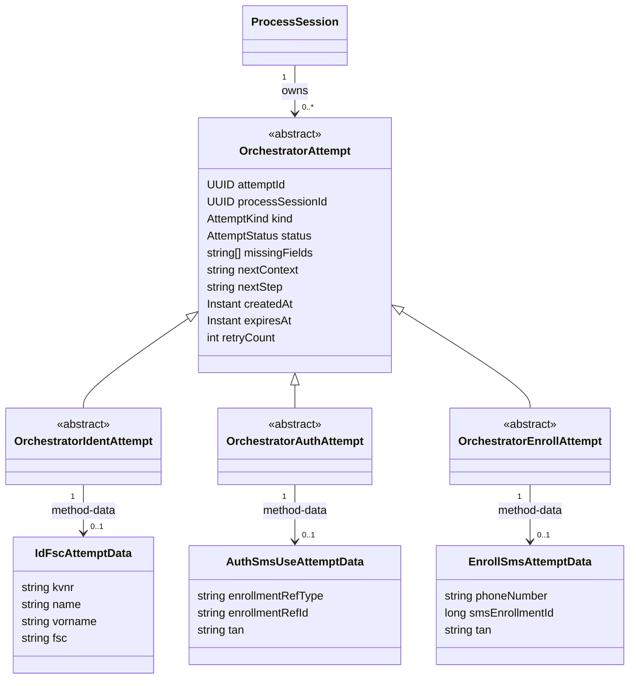
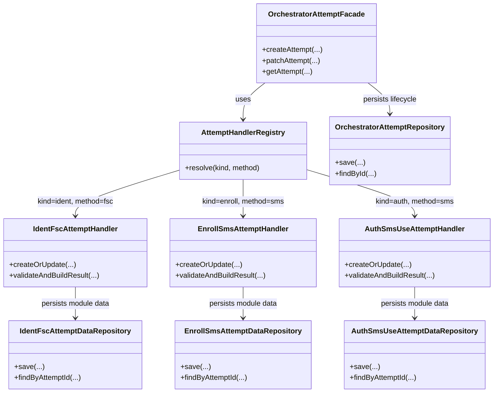
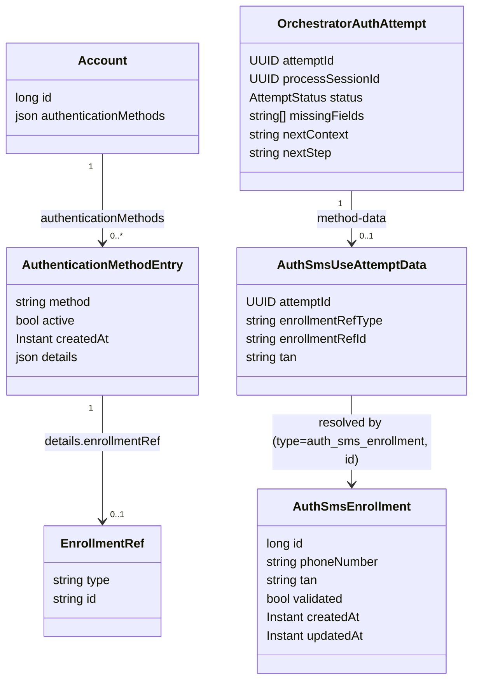
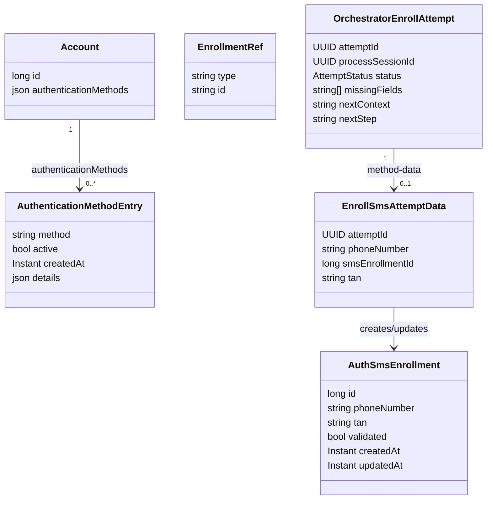
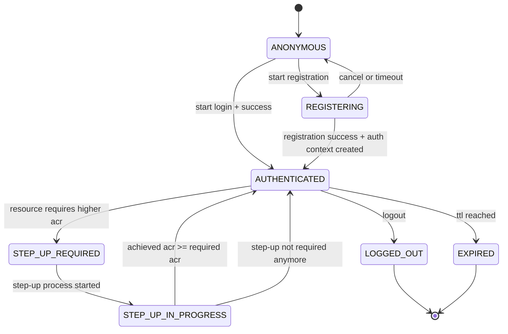
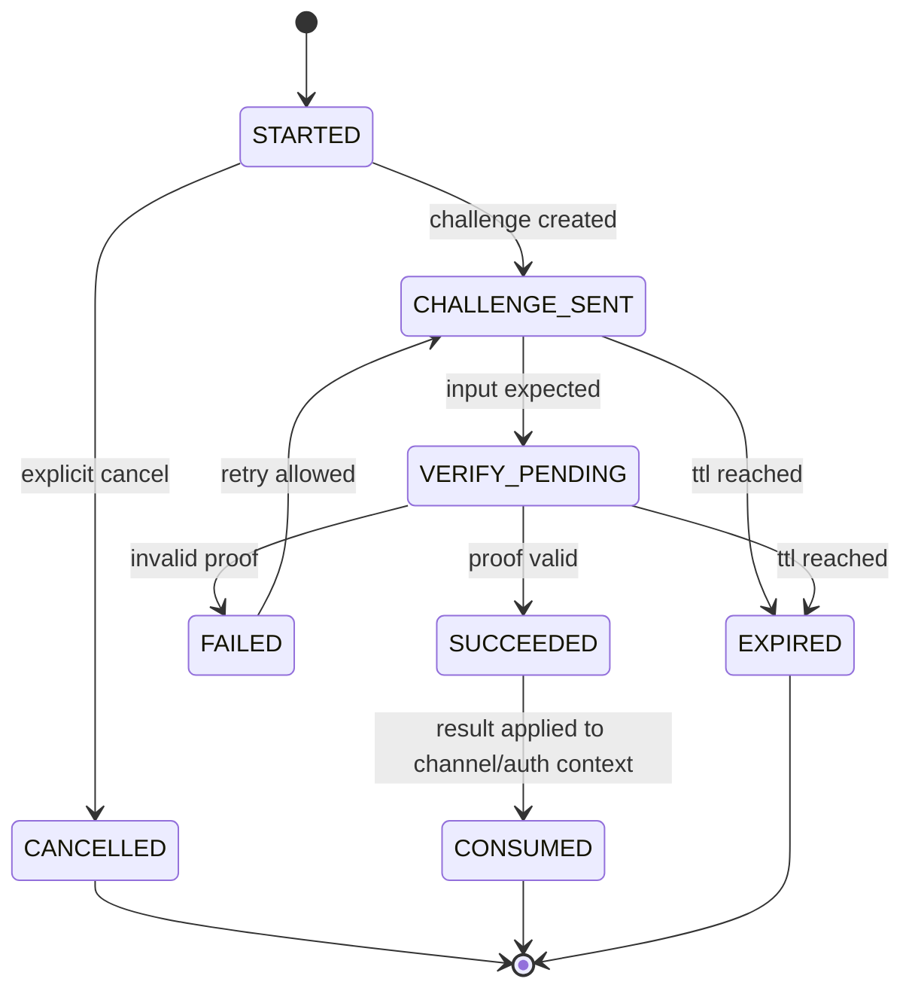

# Orchestrator-Keycloak Session-Kopplung

## Ziel und Scope

Dieses Dokument beschreibt ein umsetzbares Zielmodell fuer die Kopplung von fachlicher Orchestrator-Session und Keycloak-IAM-Session fuer:

- **App-Kanal**: Login startet fachlich im Orchestrator, danach wird Keycloak-Auth-Kontext erzeugt.
- **Web-Kanal**: Keycloak-Session existiert bereits, Orchestrator steuert nur Verfahren (z. B. Step-up).

Nicht Teil dieses Dokuments:

- konkrete Keycloak-SPI-Implementierung
- Infrastruktur-Details (Redis/DB-Cluster/Secrets-Management)

---

## Hinweis zu zukünftigen Änderungen

Bei zukünftigen Änderungswünschen an diesem Dokument weise ich dich aktiv darauf hin, wenn neue Anforderungen oder Formulierungen mit bisher getroffenen Aussagen in diesem Dokument in Konflikt stehen könnten. Ich stelle die betroffene Stelle und den Widerspruch dar und überlasse dir die Entscheidung, wie damit umgegangen werden soll, indem ich dich interaktiv frage.

---

## Begriffe

- **ChannelSession**: langlebiger serverseitiger Kanal-Kontext (App/Web), nie direkt fachlicher Challenge-State.
- **ProcessSession**: kurzlebiger fachlicher Verfahrens-Kontext (Registration, Login, Step-up).
- **AuthContext**: serverseitig gespeicherter IAM-Kontext inkl. Keycloak-Token-Referenz und `acr`/`amr`.
- **binding_key_ref**: Binding-Referenz aus DPoP-Keymaterial fuer App-Bindung.

---

## 1) Statisches Modell (Entitaeten)

### 1.1 Klassenmodell


### 1.1.1 Prozessklassen statt flachem Objekt

- `ProcessSession` ist die abstrakte Basis mit gemeinsamem Lifecycle und Referenzen.
- `RegistrationProcessSession` kapselt nur Registrierungsdaten (z. B. `personId`, Identifikation, Enrollment-Flow).
- `LoginProcessSession` kapselt nur Login-Daten (methodenspezifische Challenge ohne Identifikationsdaten).
- `StepUpProcessSession` kapselt ACR-spezifische Step-up-Daten (`requiredAcr`, `startingAcr`, `achievedAcr`).
- Persistenz darf physisch weiterhin eine Tabelle nutzen, aber das Domain-Modell arbeitet mit konkreten Typen statt einem grossen, flachen JSON-Objekt.

### 1.1.2 Entitaetsmodell fuer Ident-/Auth-/Enroll-Attempts



- `OrchestratorAttempt` (plus Untertypen) bleibt im Orchestrator-Modul und enthaelt nur lifecycle-/routing-relevante Felder.
- `AttemptKind` unterscheidet die drei Attempt-Arten: `IDENT`, `AUTH`, `ENROLL`.
- Methodenbezogene Attempt-Daten liegen in den jeweiligen Modulen: `IdFscAttemptData` im Modul `id_fsc`, `EnrollSmsAttemptData`/`AuthSmsUseAttemptData` im Modul `auth_sms`.
- Das gilt gleichermassen fuer Ident-, Auth- und Enroll-Attempts.
- Die Attempt-Entitaeten bilden direkt das API-Muster `POST` (anlegen), `PATCH` (anreichern/verifizieren), `GET` (lesen) ab.
- Fuer `auth/sms` wird kein fester `smsEnrollmentId` als Core-Feld angenommen; stattdessen verwendet das Modell eine generische Enrollment-Referenz (`enrollmentRefType`, `enrollmentRefId`), die fachlich auf einen Enrollment-Datensatz im jeweiligen Modul zeigt (bei SMS auf `auth_sms`).
- Strikte Regel fuer dieses Zielbild: Der Orchestrator persistiert keine methodenspezifischen Fachdaten (auch nicht `method`/`kind`/fachliche Ergebnisdetails); diese liegen ausschliesslich in den Methodenmodulen.

### 1.1.3 Modulklassen fuer Attempt-Verarbeitung



- Orchestrator-Modul: `OrchestratorAttemptFacade`, `AttemptHandlerRegistry`, `OrchestratorAttemptRepository`.
- Modul `id_fsc`: `IdentFscAttemptHandler` plus `IdentFscAttemptDataRepository`.
- Modul `auth_sms`: `EnrollSmsAttemptHandler`/`AuthSmsUseAttemptHandler` plus zugehoerige Repositories.
- Damit sind im Bild sowohl der zentrale Lifecycle als auch die eigentlichen Fachklassen in den Modulen sichtbar.

### 1.1.4 Konkretes Datenmodell fuer `auth/sms`

Zielprinzip:

- SMS-Fachlogik (TAN erzeugen/senden/pruefen) liegt ausschliesslich im Modul `auth_sms`.
- Der Orchestrator speichert nur Attempt-Lifecycle, Routing und Referenzen.
- Der Account speichert aktive Methoden plus generische Enrollment-Referenz in `details`.

Konkrete Persistenzsicht:



Beispiel fuer einen Eintrag in `account.authenticationMethods`:

```json
{
  "method": "sms",
  "active": true,
  "createdAt": "2026-08-17T10:15:30Z",
  "details": {
    "enrollmentRef": {
      "type": "auth_sms_enrollment",
      "id": "4711"
    }
  }
}
```

Speicherorte:

- Tabelle `account`: enthaelt `authenticationMethods` (JSON-Array) mit generischer Referenz auf Enrollment-Daten.
- Tabelle `auth_sms`: enthaelt SMS-Enrollment inkl. `phoneNumber`, `tan`, `validated`.
- Orchestrator-Attempt-Tabelle (Zielbild, z. B. `orchestrator_attempt`): enthaelt nur technische Attempt-Metadaten (`status`, `missingFields`, `nextContext`, `nextStep`, `processSessionId`, `kind`, Zeitstempel).
- Modul-Tabelle fuer `AuthSmsUseAttemptData` (Zielbild im Modul `auth_sms`): enthaelt `attemptId`, `enrollmentRefType`, `enrollmentRefId`, `tan`.

### 1.1.5 Konkretes Datenmodell fuer `enroll/sms`

Zielprinzip:

- SMS-Enrollment (Telefonnummer erfassen, TAN versenden, Enrollment aktivieren) liegt ausschliesslich im Modul `auth_sms`.
- Der Orchestrator speichert nur Attempt-Lifecycle, Routing und Referenzen.
- Das Ergebnis des Enrollments ist ein neuer Eintrag in `account.authenticationMethods` mit generischer `EnrollmentRef`.

Konkrete Persistenzsicht:



Speicherorte:

- Tabelle `account`: enthaelt nach erfolgreichem Enrollment einen neuen Eintrag in `authenticationMethods` (JSON-Array) mit generischer Referenz auf das SMS-Enrollment.
- Tabelle `auth_sms`: enthaelt SMS-Enrollment inkl. `phoneNumber`, `tan`, `validated`.
- Orchestrator-Attempt-Tabelle (Zielbild, z. B. `orchestrator_attempt`): enthaelt nur technische Attempt-Metadaten (`status`, `missingFields`, `nextContext`, `nextStep`, `processSessionId`, `kind`, Zeitstempel).
- Modul-Tabelle fuer `EnrollSmsAttemptData` (Zielbild im Modul `auth_sms`): enthaelt `attemptId`, `phoneNumber`, `smsEnrollmentId`, `tan`.

### 1.1.6 Detaillierter Code-Flow fuer `auth/sms`

#### Verantwortungen je Modul

- Orchestrator (`orchestrator`): API-Routing, Attempt-Lifecycle (`INPUT_REQUIRED`/`VERIFIED`), `next`-Ermittlung, Prozess-Gating.
- SMS-Modul (`auth_sms`): TAN erzeugen, TAN senden (Mock/Provider), TAN validieren, Laden der referenzierten Enrollment-Daten.
- Account-Modul (`account`): aktive Authentifizierungsmethoden und generische Enrollment-Referenz (`details.enrollmentRef`) bereitstellen.

#### Ablauf `auth/sms` (Zielbild)

1. `POST /orchestrator/api/v1/app/channels/{channelSessionId}/attempts/auth`
   - Request-Body enthaelt die gewaehlte Methode: `{ "method": "sms" }`.
   - Orchestrator legt eine technische Attempt-Ressource der Art `AUTH` an.
   - Orchestrator persistiert in `orchestrator_attempt`:
     - `attemptId`, `processSessionId`, `kind=AUTH`, `status=INPUT_REQUIRED`, `missingFields=["tan"]`, `nextContext=sms`, `nextStep=auth`.
   - Orchestrator delegiert an `AuthSmsUseAttemptHandler` (im Modul `auth_sms`).
   - `AuthSmsUseAttemptHandler` liest aus `account.authenticationMethods[].details.enrollmentRef` die aktive Enrollment-Referenz.
   - `auth_sms` loest Referenz auf `auth_sms.id` auf, erzeugt TAN, schreibt TAN nach `auth_sms.tan` (und ggf. `updatedAt`), versendet SMS.
   - `auth_sms` speichert in `auth_sms_use_attempt_data` die technischen Bezugsdaten (`attemptId`, `enrollmentRefType`, `enrollmentRefId`), optional noch ohne `tan`.
   - Response: `201`, `status=INPUT_REQUIRED`, `missingFields=["tan"]`, `next={context:"sms",step:"auth"}`.

2. `PATCH /orchestrator/api/v1/attempts/{attemptId}/auth/sms` mit `{ "tan": "..." }`
   - Orchestrator validiert nur Request-Form und Attempt-Status, dann Delegation an `AuthSmsUseAttemptHandler`.
   - `auth_sms` liest `auth_sms_use_attempt_data` per `attemptId`, loest Enrollment-Referenz auf und verifiziert TAN gegen `auth_sms.tan`.
   - Bei Erfolg schreibt `auth_sms` in `auth_sms.validated=true` (und `updatedAt`).
   - Optional: eingereichte TAN in `auth_sms_use_attempt_data.tan` fuer Audit/Retry-Regeln.
   - Orchestrator schreibt Ergebnis in `orchestrator_attempt`:
     - `status=VERIFIED`, `missingFields=[]`, `nextContext=authentication`, `nextStep=authenticated`.
   - Response: `200`, `status=VERIFIED`, `next={context:"authentication",step:"authenticated",...}`.

3. `GET /orchestrator/api/v1/attempts/{attemptId}/auth/sms`
   - Orchestrator liest `orchestrator_attempt` und liefert technischen Zustand (`status`, `missingFields`, `result`, `next`).
   - Keine SMS-Fachlogik im GET.

#### Fehlerfaelle

- Falsche TAN: fachlicher Fehler aus `auth_sms`, HTTP `422`.
- Attempt in ungueltigem Zustand (z. B. bereits `VERIFIED`): Orchestrator liefert HTTP `409`.
- Unbekannte Referenz (`enrollmentRef`) oder fehlendes Enrollment: HTTP `422` oder `404` gemaess Fehlervertrag.

### 1.1.7 Detaillierter Code-Flow fuer `enroll/sms`

#### Verantwortungen je Modul

- Orchestrator (`orchestrator`): API-Routing, Attempt-Lifecycle (`INPUT_REQUIRED`/`VERIFIED`), `next`-Ermittlung, Prozess-Gating.
- SMS-Modul (`auth_sms`): TAN erzeugen, TAN senden (Mock/Provider), TAN validieren, SMS-Enrollment-Datensatz anlegen und aktivieren.
- Account-Modul (`account`): Nach erfolgreichem Enrollment neuen Eintrag in `authenticationMethods` mit generischer `EnrollmentRef` erstellen.

#### Ablauf `enroll/sms` (Zielbild)

1. `POST /orchestrator/api/v1/app/channels/{channelSessionId}/attempts/enroll`
   - Request-Body enthaelt die gewaehlte Methode: `{ "method": "sms" }`.
   - Orchestrator legt eine technische Attempt-Ressource der Art `ENROLL` an.
   - Orchestrator persistiert in `orchestrator_attempt`:
     - `attemptId`, `processSessionId`, `kind=ENROLL`, `status=INPUT_REQUIRED`, `missingFields=["phoneNumber"]`, `nextContext=sms`, `nextStep=enroll`.
   - Orchestrator delegiert an `EnrollSmsAttemptHandler` (im Modul `auth_sms`).
   - Response: `201`, `status=INPUT_REQUIRED`, `missingFields=["phoneNumber"]`, `next={context:"sms",step:"enroll"}`.

2. `PATCH /orchestrator/api/v1/attempts/{attemptId}/enroll/sms` mit `{ "phoneNumber": "+49 170 1234567" }`
   - Orchestrator validiert Request-Form und Attempt-Status, dann Delegation an `EnrollSmsAttemptHandler`.
   - `auth_sms` legt einen neuen `AuthSmsEnrollment`-Datensatz an (`phoneNumber`, `validated=false`), erzeugt TAN, speichert sie und versendet SMS.
   - `auth_sms` speichert in `enroll_sms_attempt_data` die technischen Bezugsdaten (`attemptId`, `phoneNumber`, `smsEnrollmentId`).
   - Orchestrator aktualisiert `orchestrator_attempt`:
     - `status=INPUT_REQUIRED`, `missingFields=["tan"]`, `nextContext=sms`, `nextStep=tanInput`.
   - Response: `200`, `status=INPUT_REQUIRED`, `missingFields=["tan"]`, `next={context:"sms",step:"tanInput"}`.

3. `PATCH /orchestrator/api/v1/attempts/{attemptId}/enroll/sms` mit `{ "tan": "123456" }`
   - Orchestrator validiert Request-Form und Attempt-Status, dann Delegation an `EnrollSmsAttemptHandler`.
   - `auth_sms` liest `enroll_sms_attempt_data` per `attemptId`, verifiziert TAN gegen `auth_sms.tan`.
   - Bei Erfolg setzt `auth_sms` `validated=true` (und `updatedAt`).
   - Account-Modul legt neuen Eintrag in `account.authenticationMethods` an:
     - `{ "method": "sms", "active": true, "details": { "enrollmentRef": { "type": "auth_sms_enrollment", "id": "<smsEnrollmentId>" } } }`.
   - Orchestrator schreibt Ergebnis in `orchestrator_attempt`:
     - `status=VERIFIED`, `missingFields=[]`, `nextContext=authentication`, `nextStep=authenticated`.
   - Response: `200`, `status=VERIFIED`, `next={context:"authentication",step:"authenticated",...}`.

4. `GET /orchestrator/api/v1/attempts/{attemptId}/enroll/sms`
   - Orchestrator liest `orchestrator_attempt` und liefert technischen Zustand (`status`, `missingFields`, `result`, `next`).
   - Keine SMS-Fachlogik im GET.

#### Fehlerfaelle

- Falsche TAN: fachlicher Fehler aus `auth_sms`, HTTP `422`.
- Attempt in ungueltigem Zustand (z. B. bereits `VERIFIED`): Orchestrator liefert HTTP `409`.
- Ungueltige Telefonnummer: fachlicher Fehler aus `auth_sms`, HTTP `422`.

### 1.2 Enumerationen

- `Channel`: `APP`, `WEB`
- `ChannelState`: `ANONYMOUS`, `REGISTERING`, `AUTHENTICATED`, `STEP_UP_REQUIRED`, `STEP_UP_IN_PROGRESS`, `LOGGED_OUT`, `EXPIRED`
- `ProcessPurpose`: `REGISTRATION`, `LOGIN`, `STEP_UP`
- `ProcessStatus`: `STARTED`, `CHALLENGE_SENT`, `VERIFY_PENDING`, `SUCCEEDED`, `FAILED`, `CANCELLED`, `EXPIRED`, `CONSUMED`
- `AttemptKind`: `IDENT`, `AUTH`, `ENROLL`
- `AttemptStatus`: `INPUT_REQUIRED`, `VERIFIED`, `FAILED`, `EXPIRED`, `CANCELLED`

### 1.3 Persistenz-Regeln

- `ChannelSession.channelSessionId` ist stabil und opaque; App/Web kennen nur diese technische Referenz.
- `ProcessSession` ist immer kurzlebig und nach Abschluss `CONSUMED` oder `EXPIRED`.
- Prozessspezifische Felder werden nur im jeweils passenden Typ gefuehrt (keine "immer vorhandenen" Universal-Felder).
- Attempt-Lifecycle und Routing-Metadaten liegen zentral im Orchestrator; methodenspezifische Attempt-Felder liegen in den jeweiligen Fachmodulen.
- Attempt-Lifecycle und Routing-Metadaten liegen zentral im Orchestrator; methodenspezifische Attempt-Felder und fachliche Verifikationsdetails liegen ausschliesslich in den jeweiligen Fachmodulen.
- `AuthContext` ist serverseitig; Clients sehen keine Keycloak-Tokens.
- `ChannelSession.state` ist die primäre Runtime-Entscheidungsquelle fuer Request-Gating.
- App-Bindung: `ChannelSession.bindingKeyRef` muss mit aktuellem DPoP-Ableitungswert matchen.

---

## 2) Zustandsdiagramme

### 2.1 ChannelSession-Zustaende



### 2.2 ProcessSession-Zustaende



---

## 3) Kanal-Ablaufmodell

### 3.1 App (Orchestrator-first)

1. App sendet Request mit DPoP -> Backend erstellt/liest `ChannelSession(APP)`.
2. Fuer Erstzugang startet Backend `ProcessSession(REGISTRATION|LOGIN)`.
3. Orchestrator fuehrt fachliche Verfahren aus (FSC/SMS/eID).
4. Bei Erfolg erzeugt Backend den `AuthContext` (Keycloak-Tokenfluss serverseitig).
5. `ChannelSession.state` wechselt auf `AUTHENTICATED`.
6. Bei spaeteren Requests prueft Backend `currentAcr/currentAmr` aus `AuthContext`.
7. Falls Niveau nicht reicht: `STEP_UP_REQUIRED` -> neue `ProcessSession(STEP_UP)`.

### 3.2 Web (Keycloak-first)

1. Browser/BFF hat Keycloak-Session.
2. Keycloak-Authenticator startet bei Bedarf Step-up beim Orchestrator.
3. Backend erstellt `ProcessSession(STEP_UP)` und referenziert die `ChannelSession(WEB)`.
4. Nach fachlichem Erfolg aktualisiert Keycloak den IAM-Kontext.
5. Backend synchronisiert `AuthContext.currentAcr/currentAmr`.
6. `ChannelSession.state` bleibt oder wird wieder `AUTHENTICATED`.

---

## 4) API-Spezifikation

### 4.1 API-Spezifikation (implementiert)

Festgelegte API-Entscheidung:

- Das oeffentliche API wird unter `/orchestrator/api/v1` versioniert.
- Unterschiedliche Methoden und Modi werden ueber getrennte konkrete Endpunkte modelliert.
- Die URL bestimmt die Operation; derselbe Endpunkt darf nicht allein anhand unterschiedlicher Request-Bodies verschiedene fachliche Ablaufe ausfuehren.
- Vorbereitende Methoden nutzen ressourcenorientierte Attempt-Objekte: `POST` erzeugt den Attempt ueber den Channel (Methode im Body), `PATCH` aktualisiert die methodenspezifische Attempt-Ressource, `GET` liest den Stand.
- Bei `PATCH` wird grundsaetzlich nur der aktuell nachzuliefernde oder zu aendernde Teil uebergeben; bereits vorhandene Felder duerfen dabei gezielt ueberschrieben werden.
- Solange Pflichtdaten fehlen, bleibt die Ressource in `INPUT_REQUIRED` (HTTP `200`, kein Fehlerfall); bei Vollstaendigkeit liefert sie `VERIFIED` plus `result`.
- HATEOAS wird im Zielbild nicht verwendet.
- Der Client leitet den naechsten technischen Call aus `next.context`, `next.step` und - falls vorhanden - dem gewaehlten Eintrag aus `methods` ueber eine feste Routing-Tabelle ab.
- Lesbarkeit hat Vorrang vor maximal generischem API-Wiring: methoden- und artspezifische Endpunkte sowie klar benannte DTOs/Handler (`ident/fsc`, `enroll/sms`, `auth/sms`) sind gewollt, auch wenn dafuer etwas mehr expliziter Code entsteht.

#### App-Fassade (Orchestrator-first)

Die folgenden Endpunkte sind als Zielbild fuer einen durchgaengigen App-Flow gedacht. Alle Requests enthalten den Header `DPoP: <proof>`.

Designentscheidung:

- `processSessionId` bleibt als interne Prozessinstanz fuer Persistenz, Korrelation und Audit erhalten.
- Die fachliche Prozesswahl (`REGISTRATION`, `LOGIN`, `STEP_UP`) trifft das Backend auf Basis von Kanalzustand, Accountstatus und Policy.
- Oeffentliche App-APIs verwenden nur `channelSessionId`; weder `purpose` noch die interne `processSessionId` werden vom Client vorgegeben.
- Das `next`-Objekt nutzt genau zwei fachliche Routing-Attribute: `context` und `step`.
- Bei Auswahlseiten enthaelt `next.methods` nur echte technische Methoden-Keys wie `sms` oder `passkey`; die Attempt-Art (`ident`/`enroll`/`auth`) steckt dort nicht, sondern wird serverseitig bestimmt.
- Die UI leitet den naechsten Call aus `(context, step)` und - bei Auswahlseiten - aus dem gewaehlten `methods`-Eintrag ueber eine feste Routing-Tabelle ab; URLs sind feste technische Endpunkte und keine Entscheidungsquelle.
- Der Client darf `ident`/`enroll`/`auth` nie aus Sessionzustand oder aus einer Methodenliste erraten; die Attempt-Art wird serverseitig festgelegt und in der URL widergespiegelt.
- Wenn genau eine Methode erlaubt ist, darf das Backend die Auswahlseite ueberspringen und direkt den methodenspezifischen Folgeschritt liefern, z. B. `{ "context": "sms", "step": "enroll" }` fuer `enroll/sms` oder `{ "context": "sms", "step": "auth" }` fuer `auth/sms`.
- Ergebnislieferung: Sobald eine Attempt-Ressource vollstaendig und validiert ist, liefert dieselbe Ressource das fachliche `result` im Response-Body.

Pfadkonvention:

- Einstieg: `POST /orchestrator/api/v1/app/channels`
- Laufende Prozessschritte: `/orchestrator/api/v1/app/channels/{channelSessionId}/...`
- Attempt-Auswahl/-Anlage ueber Channel: `POST /orchestrator/api/v1/app/channels/{channelSessionId}/attempts/{kind}` (Methode im Body)
- Attempt-Fortschreibung/-Lesen: `PATCH/GET /orchestrator/api/v1/attempts/{attemptId}/{kind}/{method}`

Konsistenzregel:

- Pro `channelSessionId` darf es hoechstens einen aktiven oeffentlichen Prozesskontext geben. Welcher interne `purpose` dazu gehoert, entscheidet und verwaltet das Backend.

Konsistentes Beispiel ueber alle Calls:

- `channelSessionId`: `c1111111-1111-1111-1111-111111111111`
- Identifikation: `fsc`
- Authentifizierung: `sms`

##### 1) `POST /orchestrator/api/v1/app/channels`

Zweck:

- Erstkontakt der App mit dem Backend.
- Liefert eine neue oder bestehende `ChannelSession`.
- Das Backend leitet dabei sofort den aktuell noetigen fachlichen Prozess ab und liefert direkt den ersten fachlichen `next`-Schritt.

Request (optional, wenn App eine bestehende Channel-Session fortsetzen will):

```json
{
  "channelSessionId": null
}
```

Response `200`:

```json
{
  "channelSessionId": "c1111111-1111-1111-1111-111111111111",
  "state": "ANONYMOUS",
  "next": {
    "context": "registration",
    "step": "selectIdentificationMethod",
    "methods": ["fsc"]
  }
}
```

##### 2) `POST /orchestrator/api/v1/app/channels/{channelSessionId}/attempts/ident`

Zweck:

- Waehlt die Methode fuer einen neuen Ident-Attempt aus und erzeugt die technische Attempt-Ressource.
- In diesem Beispiel: `fsc`.

Request:

```json
{
  "method": "fsc"
}
```

Response `201`:

```json
{
  "attemptId": "i7777777-7777-7777-7777-777777777777",
  "status": "INPUT_REQUIRED",
  "missingFields": ["kvnr", "name", "vorname"],
  "result": null,
  "next": {
    "context": "fsc",
    "step": "input"
  }
}
```

##### 3) `PATCH /orchestrator/api/v1/attempts/{attemptId}/ident/fsc`

Zweck:

- Ergaenzt fehlende Felder auf der FSC-Attempt-Ressource; bei Bedarf duerfen bereits gesetzte Felder gezielt ueberschrieben werden.

Request (erste Datenlieferung):

```json
{
  "kvnr": "A123456789",
  "name": "Muster",
  "vorname": "Max"
}
```

Response `200` bei unvollstaendiger Eingabe:

```json
{
  "attemptId": "i7777777-7777-7777-7777-777777777777",
  "status": "INPUT_REQUIRED",
  "missingFields": ["fsc"],
  "result": null,
  "next": {
    "context": "fsc",
    "step": "input"
  }
}
```

Request (zweite Datenlieferung):

```json
{
  "fsc": "TESTCODE123"
}
```

Response `200` bei erfolgreicher Verifikation:

```json
{
  "attemptId": "i7777777-7777-7777-7777-777777777777",
  "status": "VERIFIED",
  "missingFields": [],
  "result": {
    "identified": true,
    "personId": 5001
  },
  "next": {
    "context": "enrollment",
    "step": "selectMethod",
    "methods": ["sms"]
  }
}
```

##### 4) `GET /orchestrator/api/v1/attempts/{attemptId}/ident/fsc`

Zweck:

- Liest den aktuellen Zustand der FSC-Attempt-Ressource.
- Dient fuer Resume/Polling und UI-Synchronisation.

Request:

Response `200` Beispiel:

```json
{
  "attemptId": "i7777777-7777-7777-7777-777777777777",
  "status": "INPUT_REQUIRED",
  "missingFields": ["fsc"],
  "result": null,
  "next": {
    "context": "fsc",
    "step": "input"
  }
}
```

##### 5) `POST /orchestrator/api/v1/app/channels/{channelSessionId}/attempts/enroll`

Zweck:

- Waehlt die Methode fuer einen neuen Enroll-Attempt aus und erzeugt die technische Attempt-Ressource.
- Beispiel hier: `enroll` bei Registration.
- Fuer Login/Step-up existiert der separate, explizite Endpoint `POST /orchestrator/api/v1/app/channels/{channelSessionId}/attempts/auth`.
- Das Frontend leitet `enroll` oder `auth` aus `next.context` ab; die konkrete Methode stammt - falls noetig - aus `next.methods`.

Request:

```json
{
  "method": "sms"
}
```

Response `201`:

```json
{
  "attemptId": "a3333333-3333-3333-3333-333333333333",
  "status": "INPUT_REQUIRED",
  "missingFields": ["phoneNumber"],
  "result": null,
  "next": {
    "context": "sms",
    "step": "enroll"
  }
}
```

##### 6) `PATCH /orchestrator/api/v1/attempts/{attemptId}/enroll/sms`

Zweck:

- Ergaenzt oder aktualisiert partiell Daten einer konkreten SMS-Enrollment-Attempt.
- Diese Route ist nur fuer den Enrollment-Fall definiert.
- Der Request enthaelt nur die Felder, die in diesem Schritt fehlen oder bewusst geaendert werden sollen.

Request (Telefonnummer):

```json
{
  "phoneNumber": "+49 170 1234567"
}
```

Response `200`:

```json
{
  "attemptId": "a3333333-3333-3333-3333-333333333333",
  "status": "INPUT_REQUIRED",
  "missingFields": ["tan"],
  "next": {
    "context": "sms",
    "step": "tanInput"
  }
}
```

Request (TAN):

```json
{
  "tan": "123456"
}
```

Response `200` bei erfolgreicher Verifikation:

```json
{
  "attemptId": "a3333333-3333-3333-3333-333333333333",
  "status": "VERIFIED",
  "result": {
    "authenticated": true,
    "method": "sms",
    "kind": "enroll"
  },
  "next": {
    "context": "authentication",
    "step": "authenticated",
    "accountId": 1001,
    "personId": 5001
  }
}
```

##### 7) `GET /orchestrator/api/v1/attempts/{attemptId}/enroll/sms`

Zweck:

- Liest den stabilen Attempt-Zustand fuer Resume/Polling.

Response `200`:

```json
{
  "attemptId": "a3333333-3333-3333-3333-333333333333",
  "status": "INPUT_REQUIRED",
  "missingFields": ["tan"],
  "result": null,
  "next": {
    "context": "sms",
    "step": "tanInput"
  }
}
```

##### 8) `GET /orchestrator/api/v1/app/channels/{channelSessionId}`

Zweck:

- Liest den stabilen Kanalzustand fuer Folgerequests.
- Dient als einfache Session- und Policy-Sicht fuer die App.

Response `200`:

```json
{
  "channelSessionId": "c1111111-1111-1111-1111-111111111111",
  "state": "AUTHENTICATED",
  "currentAcr": "loa2",
  "currentAmr": ["fsc", "sms"],
  "stepUpRequired": false
}
```

##### Erreichbare APIs je Prozess (Beispielregel)

- Wenn das Backend intern `REGISTRATION` gewaehlt hat, liefert es nach der Identifikation entweder direkt einen methodenspezifischen Schritt wie `next = { context: "sms", step: "enroll" }` fuer `enroll/sms` oder - bei echter Auswahl - `next = { context: "enrollment", step: "selectMethod", methods: [...] }`.
- Wenn das Backend intern `LOGIN` oder `STEP_UP` gewaehlt hat, liefert es analog entweder direkt einen Auth-Schritt wie `next = { context: "sms", step: "auth" }` fuer `auth/sms` oder - bei mehreren erlaubten Verfahren - `next = { context: "auth", step: "selectMethod", methods: [...] }`.
- Wenn eine nicht erlaubte Aktion fuer den Prozess aufgerufen wird: `409 invalid_state` mit `allowedActions`.
- Fuer den Client ist damit keine URL-Auswertung und keine eigene Ableitung von `ident`/`enroll`/`auth` erforderlich.

##### Durchgaengiger Sequenzblick (kurz)

1. Channel anlegen/holen (`POST /orchestrator/api/v1/app/channels`)
2. FSC-Attempt auswaehlen/anlegen (`POST /orchestrator/api/v1/app/channels/{channelSessionId}/attempts/ident`)
3. FSC-Attempt mit Identifikationsdaten befuellen (`PATCH /orchestrator/api/v1/attempts/{attemptId}/ident/fsc`)
4. FSC-Attempt mit FSC verifizieren (`PATCH /orchestrator/api/v1/attempts/{attemptId}/ident/fsc`)
5. FSC-Attempt-Zustand lesen (`GET /orchestrator/api/v1/attempts/{attemptId}/ident/fsc`)
6. SMS-Enrollment-Attempt auswaehlen/anlegen (`POST /orchestrator/api/v1/app/channels/{channelSessionId}/attempts/enroll`)
7. SMS-Enrollment-Attempt mit `phoneNumber` befuellen (`PATCH /orchestrator/api/v1/attempts/{attemptId}/enroll/sms`)
8. SMS-Enrollment-Attempt mit `tan` abschliessen (`PATCH /orchestrator/api/v1/attempts/{attemptId}/enroll/sms`)
9. SMS-Enrollment-Attempt-Zustand lesen (`GET /orchestrator/api/v1/attempts/{attemptId}/enroll/sms`)
10. Finalen Kanalstatus lesen (`GET /orchestrator/api/v1/app/channels/{channelSessionId}`)

#### Web/Keycloak-Fassade (Keycloak-first)

- `POST /orchestrator/api/v1/kc/sessions/{kcSessionId}/processes/step-up`
- `POST /orchestrator/api/v1/kc/sessions/{kcSessionId}/processes/login`
- optional: `POST /orchestrator/api/v1/kc/sessions/{kcSessionId}/processes/{purpose}/cancel`

Beispiel `POST /orchestrator/api/v1/kc/sessions/{kcSessionId}/processes/step-up`:

```json
{
  "channelSessionId": "uuid",
  "keycloakSessionId": "kc-session-id",
  "keycloakSubject": "user-sub",
  "currentAcr": "loa1",
  "requiredAcr": "loa2",
  "amr": ["pwd"]
}
```

Antwort `201`:

```json
{
  "status": "STARTED",
  "next": {
    "context": "sms",
    "step": "auth"
  }
}
```

### 4.3 Hybrid-Modell: Prozess-API + Attempt-Ressourcen

Ziel:

- Prozesssicht und Fachfuehrung bleiben in den Prozess-Endpoints sichtbar.
- App-Frontend und Keycloak nutzen fuer Eingabe- und Verifikationsschritte dieselben kanalneutralen Attempt-URLs.

Kernidee:

1. Channel-Endpunkt waehlt die Attempt-Art und -Methode aus und erzeugt eine technische Attempt-Ressource.
2. Backend erstellt die methodenspezifische Attempt-Ressource (`OrchestratorIdentAttempt`, `OrchestratorEnrollAttempt` oder `OrchestratorAuthAttempt`).
3. Die Channel-API nimmt dabei keine fachlichen Eingabedaten entgegen; lediglich der Methoden-Key steht im Body.
4. Das Backend liefert einen fachlich eindeutigen `next`-Zustand, z. B. `{"context":"enrollment","step":"selectMethod","methods":["sms"]}` oder `{"context":"sms","step":"auth"}`.
5. App oder Keycloak nutzen eine feste Routing-Tabelle von `context`, `step` und - falls vorhanden - dem gewaehlten Methoden-Key auf die passenden Endpunkte und leiten nichts aus URLs ab.

#### Ressourcenmodell

- `ProcessSession` bleibt der fachliche Owner.
- Neue technische Ressourcen: `IdentAttempt`, `EnrollAttempt` und `AuthAttempt`
  - `attemptId`
  - `processSessionId` (nur intern)
  - `kind` (`IDENT`, `ENROLL`, `AUTH`)
  - `status` (`INPUT_REQUIRED`, `VERIFIED`, `EXPIRED`, ...)
  - `missingFields`
  - `nextContext`
  - `nextStep`
  - `expiresAt`, `retryCount`

Klarstellung zum Persistenzmodell:

- Der Orchestrator persistiert fuer Attempts nur Lifecycle- und Routing-Metadaten.
- `method` und `kind` werden nicht als zentrale Datenfelder gespeichert, sondern aus der anlegenden Route und dem konkreten Attempt-Typ abgeleitet.
- Fachliche Ergebnisdaten bleiben in den jeweiligen Methodenmodulen; `GET`-Responses baut der Orchestrator aus zentralem Attempt-Zustand und Moduldaten zusammen.

#### API-Schnitt

Start erfolgt ueber den Channel-Endpunkt und ist parameterarm:

- `POST /orchestrator/api/v1/app/channels/{channelSessionId}/attempts/ident`
- `POST /orchestrator/api/v1/app/channels/{channelSessionId}/attempts/enroll`
- `POST /orchestrator/api/v1/app/channels/{channelSessionId}/attempts/auth`
- `POST /orchestrator/api/v1/kc/sessions/{kcSessionId}/processes/{purpose}/attempts/auth`

Fuer Lesbarkeit und klare Verantwortlichkeit werden `ident`, `enroll` und `auth` als eigenstaendige Attempt-Arten (`AttemptKind`) und damit als getrennte, explizite Endpunkte dokumentiert (kein Platzhalter `{kind}` in den konkreten Channel-Endpunkten).

Die eigentliche Parametereingabe und Verifikation laufen danach ueber eine kanalneutrale Attempt-API. Die drei Attempt-Arten `ident`, `enroll` und `auth` werden als getrennte konkrete Endpunkte modelliert, damit kein Endpunkt anhand des Request-Bodys unterschiedliche Prozesse ausfuehrt.

Fuer `PATCH` gilt dabei durchgaengig: Der Client sendet nur den aktuell fehlenden oder zu korrigierenden Teil der Attempt-Daten; bereits vorhandene Werte koennen gezielt ueberschrieben werden, muessen aber nicht erneut vollstaendig mitgesendet werden.

- `PATCH /orchestrator/api/v1/attempts/{attemptId}/ident/fsc`
- `GET /orchestrator/api/v1/attempts/{attemptId}/ident/fsc`
- `PATCH /orchestrator/api/v1/attempts/{attemptId}/enroll/sms`
- `GET /orchestrator/api/v1/attempts/{attemptId}/enroll/sms`
- `PATCH /orchestrator/api/v1/attempts/{attemptId}/auth/sms`
- `GET /orchestrator/api/v1/attempts/{attemptId}/auth/sms`

Beispiel Prozess-Start `POST /orchestrator/api/v1/app/channels/{channelSessionId}/attempts/enroll`:

```json
{
  "method": "sms"
}
```

Beispielantwort beim Prozess-Start:

```json
{
  "attemptId": "a3333333-3333-3333-3333-333333333333",
  "status": "INPUT_REQUIRED",
  "missingFields": ["phoneNumber"],
  "next": {
    "context": "sms",
    "step": "enroll"
  }
}
```

Beispiel `PATCH` auf Attempt-Root fuer `enroll/sms` (Telefonnummer):

```json
{
  "phoneNumber": "+49 170 1234567"
}
```

Antwort `200`:

```json
{
  "attemptId": "a3333333-3333-3333-3333-333333333333",
  "status": "INPUT_REQUIRED",
  "missingFields": ["tan"],
  "next": {
    "context": "sms",
    "step": "tanInput"
  }
}
```

Beispiel `PATCH` fuer `enroll/sms` (TAN):

```json
{
  "tan": "123456"
}
```

Antwort `200`:

```json
{
  "attemptId": "a3333333-3333-3333-3333-333333333333",
  "status": "VERIFIED",
  "missingFields": [],
  "result": {
    "authenticated": true,
    "method": "sms",
    "kind": "enroll"
  },
  "next": {
    "context": "authentication",
    "step": "authenticated",
    "accountId": 1001,
    "personId": 5001
  }
}
```

Analoges Beispiel fuer eine Identifikationsmethode `fsc`:

- Prozess-Start: `POST /orchestrator/api/v1/app/channels/{channelSessionId}/attempts/ident`
- Request:

```json
{
  "method": "fsc"
}
```

- Rueckgabe bei unvollstaendiger Eingabe:

```json
{
  "attemptId": "i7777777-7777-7777-7777-777777777777",
  "status": "INPUT_REQUIRED",
  "missingFields": ["kvnr", "name", "vorname"],
  "next": {
    "context": "fsc",
    "step": "input"
  }
}
```

Beispiel `PATCH` fuer FSC (Identifikationsdaten):

```json
{
  "kvnr": "A123456789",
  "name": "Muster",
  "vorname": "Max"
}
```

Antwort `200`:

```json
{
  "attemptId": "i7777777-7777-7777-7777-777777777777",
  "status": "INPUT_REQUIRED",
  "missingFields": ["fsc"],
  "next": {
    "context": "fsc",
    "step": "input"
  }
}
```

Beispiel `PATCH` fuer FSC (Verifikation):

```json
{
  "fsc": "TESTCODE123"
}
```

Antwort `200`:

```json
{
  "attemptId": "i7777777-7777-7777-7777-777777777777",
  "status": "VERIFIED",
  "missingFields": [],
  "result": {
    "identified": true,
    "personId": 5001
  },
  "next": {
    "context": "enrollment",
    "step": "selectMethod",
    "methods": ["sms"]
  }
}
```

Separates Beispiel fuer `auth/sms`:

- Prozess-Start: `POST /orchestrator/api/v1/app/channels/{channelSessionId}/attempts/auth`
- Request:

```json
{
  "method": "sms"
}
```

- Rueckgabe:

```json
{
  "attemptId": "a4444444-4444-4444-4444-444444444444",
  "status": "INPUT_REQUIRED",
  "missingFields": ["tan"],
  "next": {
    "context": "sms",
    "step": "auth"
  }
}
```

Beispiel `PATCH` fuer `auth/sms` (TAN):

```json
{
  "tan": "123456"
}
```

Antwort `200`:

```json
{
  "attemptId": "a4444444-4444-4444-4444-444444444444",
  "status": "VERIFIED",
  "result": {
    "authenticated": true,
    "method": "sms",
    "kind": "auth"
  },
  "next": {
    "context": "authentication",
    "step": "authenticated",
    "accountId": 1001,
    "personId": 5001
  }
}
```

#### Gibt es doppelte APIs?

Nein, wenn die Verantwortung klar getrennt ist:

- Prozess-API: kanal- und fachkontextspezifischer Start (`app` oder `kc`), Policy, Ableitung des intern noetigen `purpose`, Reservierung einer Attempt-Instanz
- Attempt-API: kanalneutrale technische Parametereingabe und Verifikation ueber dieselbe Ressource (`PATCH`/`GET`); unterschiedliche fachliche Varianten wie `enroll/sms` und `auth/sms` werden als getrennte konkrete Endpunkte modelliert

Damit ist nur die fachliche Freigabe prozess- und kanalabhaengig; Startparameter und Verifikation laufen danach kanalneutral ueber ein einheitliches Attempt-Muster.

---

## 5) Fehler und Konsistenz

Standardfehler (Ist und Soll):

- `400 Bad Request`: invalid payload / structurally invalid request
- `401 Unauthorized`: missing/invalid DPoP, invalid channel trust
- `403 Forbidden`: binding mismatch, policy violation
- `404 Not Found`: unknown session/process
- `409 Conflict`: invalid state transition, disallowed action, concurrent process on same channel session
- `410 Gone`: process expired/consumed
- `422 Unprocessable Entity`: challenge verification failed

Konsistenz-Regeln:

- Pro `ChannelSession` maximal ein aktiver `ProcessSession` je `purpose`.
- `ProcessSession` darf nur auf gueltige Folgezustaende wechseln.
- `AuthContext` wird nur bei `SUCCEEDED` aktualisiert.
- Jede relevante Transition erzeugt einen `SessionEvent` Audit-Eintrag.

---

## 6) Mapping auf bestehende Konzepte im Repo

- Die `binding_session`-Tabelle wurde vollstaendig entfernt (Flyway V16); fachlicher Flow-Kontext wird nun ueber `ProcessSession` abgebildet.
- Das alte Public-API (`/orchestrator/sessions`) wurde entfernt; das aktuelle API liegt unter `/orchestrator/api/v1/app/...`.
- `ChannelSession` ist langlebig und DPoP-gebunden ueber `binding_key_ref`.
- `AuthContext` ist bereit fuer Keycloak-Integration (Struktur vorhanden, Keycloak-Anbindung noch nicht implementiert).

---

## 7) Flow-Architektur: State + Effects + Prozess-Entkopplung

### Grundprinzip

Flows und Prozesse sind vollständig voneinander getrennt:

- **Flow**: kennt nur seinen eigenen Zustand und entscheidet über den nächsten Schritt sowie auszuführende Effekte.
- **Prozess**: kennt keine Flow-Internals — er erhält nur ein neutrales `FlowOutcome` und entscheidet daraus seinen nächsten Schritt.

### Neutraler Vertrag (Flow → Prozess)

```kotlin
sealed interface FlowOutcome {
    data class InProgress(val missingFields: List<String> = emptyList()) : FlowOutcome
    data object Completed : FlowOutcome
    data class Failed(val reason: String) : FlowOutcome
}
```

Der Flow liefert immer genau eines dieser drei Ergebnisse. Der Prozess wertet ausschließlich dieses Ergebnis aus.

### Flow-Struktur (Beispiel: SMS-Enrollment)

```kotlin
class SmsEnrollFlow {

    sealed interface State
    data object AwaitingPhone : State
    data class AwaitingTan(val ref: EnrollmentRef) : State
    data class Verified(val ref: EnrollmentRef) : State

    data class Input(val phoneNumber: String?, val tan: String?)

    sealed interface Effect
    data class StartEnrollment(val phoneNumber: String) : Effect
    data class ConfirmEnrollment(val ref: EnrollmentRef, val tan: String) : Effect
    data class ActivateMethod(val ref: EnrollmentRef) : Effect

    data class Decision(
        val nextState: State,
        val effects: List<Effect> = emptyList(),
        val outcome: FlowOutcome = FlowOutcome.InProgress()
    )

    fun decide(state: State, input: Input): Decision = when (state) {
        AwaitingPhone -> {
            if (input.phoneNumber.isNullOrBlank())
                Decision(nextState = state, outcome = FlowOutcome.InProgress(listOf("phoneNumber")))
            else
                Decision(
                    nextState = state,
                    effects = listOf(StartEnrollment(input.phoneNumber))
                )
        }
        is AwaitingTan -> {
            if (input.tan.isNullOrBlank())
                Decision(nextState = state, outcome = FlowOutcome.InProgress(listOf("tan")))
            else
                Decision(
                    nextState = Verified(state.ref),
                    effects = listOf(
                        ConfirmEnrollment(state.ref, input.tan),
                        ActivateMethod(state.ref)
                    ),
                    outcome = FlowOutcome.Completed
                )
        }
        is Verified -> Decision(nextState = state, outcome = FlowOutcome.Completed)
    }
}
```

### Prozess-Ebene (kennt nur FlowOutcome)

```kotlin
enum class ProcessStep { ENROLL_SMS, ISSUE_TOKEN, ABORT }

class RegistrationProcess {
    fun nextStep(current: ProcessStep, outcome: FlowOutcome): ProcessStep =
        when (outcome) {
            is FlowOutcome.InProgress -> current          // Flow läuft noch
            is FlowOutcome.Completed  -> ProcessStep.ISSUE_TOKEN
            is FlowOutcome.Failed     -> ProcessStep.ABORT
        }
}
```

### Eigenschaften dieses Musters

| Eigenschaft | Flow | Prozess |
|---|---|---|
| Kennt interne Zustände | ✅ eigene `State` | ❌ nur `FlowOutcome` |
| Entscheidet nächsten Schritt | ✅ `nextState` | ✅ basierend auf `outcome` |
| Löst Seiteneffekte aus | ✅ via `effects` | ❌ |
| Änderbar ohne andere zu beeinflussen | ✅ | ✅ |

### Zweistufige Navigation

- **Solange der Flow läuft** (`InProgress`): Flow bestimmt den internen nächsten Schritt.
- **Wenn der Flow abgeschlossen ist** (`Completed`/`Failed`): Prozess entscheidet den nächsten Prozessschritt.

Diese Trennung erlaubt es, Flows auszutauschen oder neue hinzuzufügen, ohne die Prozess-Ebene zu ändern — und umgekehrt.

---

## 8) Umsetzungsstatus

1. **Schritt 1** ✅: Entitaeten `ChannelSession`, `AuthContext`, `SessionEvent` hinzugefuegt.
2. **Schritt 2** ✅: Bestehende Flow-Session in konkrete Prozessklassen aufgeteilt (`RegistrationProcessSession`, `LoginProcessSession`, `StepUpProcessSession`).
3. **Schritt 3** ✅: App-API-Fassade (`/orchestrator/api/v1/app/...`) aufgebaut; alte Ist-Stand-API entfernt.
4. **Schritt 4** 🔲: Keycloak-Fassade (`/orchestrator/api/v1/kc/...`) mit Step-up-Start/Confirm (noch nicht implementiert).
5. **Schritt 5** 🔲: Policy-Gating anhand `currentAcr/currentAmr` zentralisieren (noch nicht implementiert).
